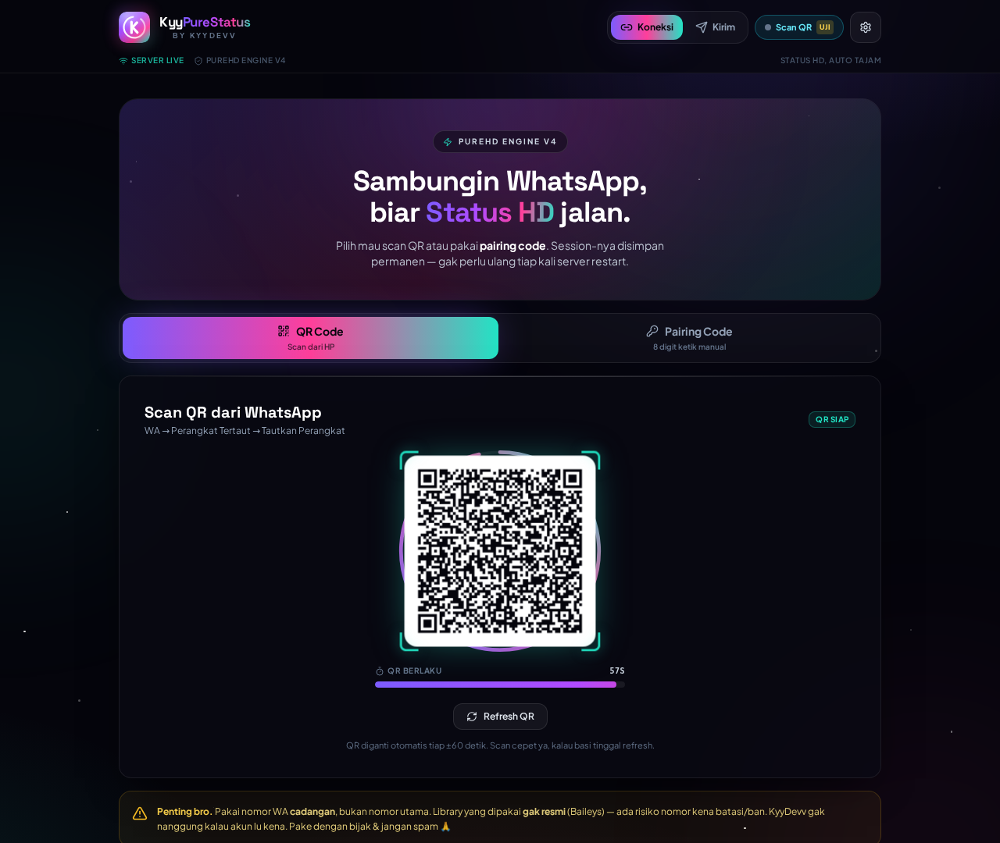
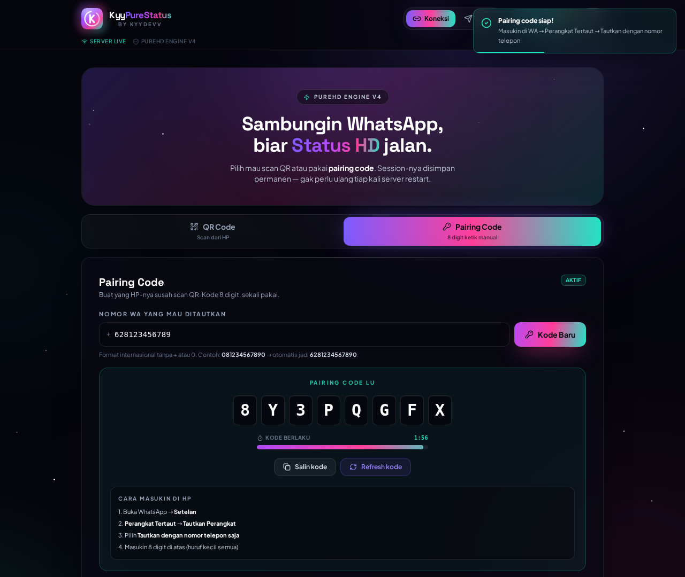
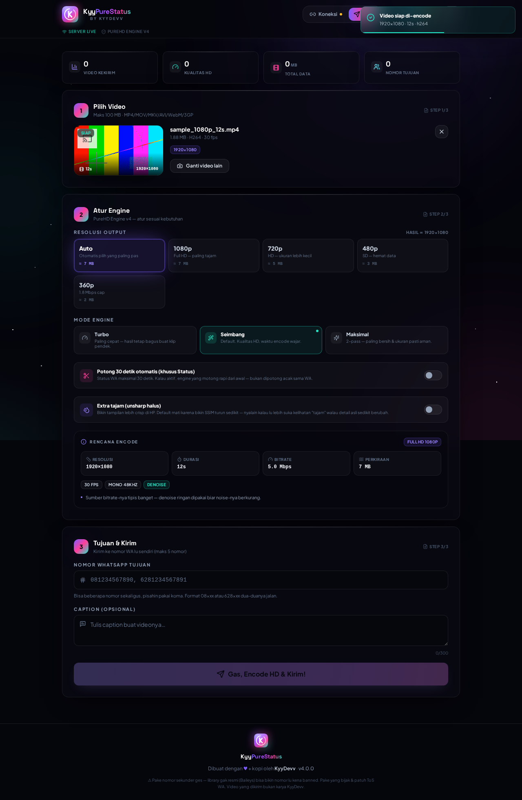
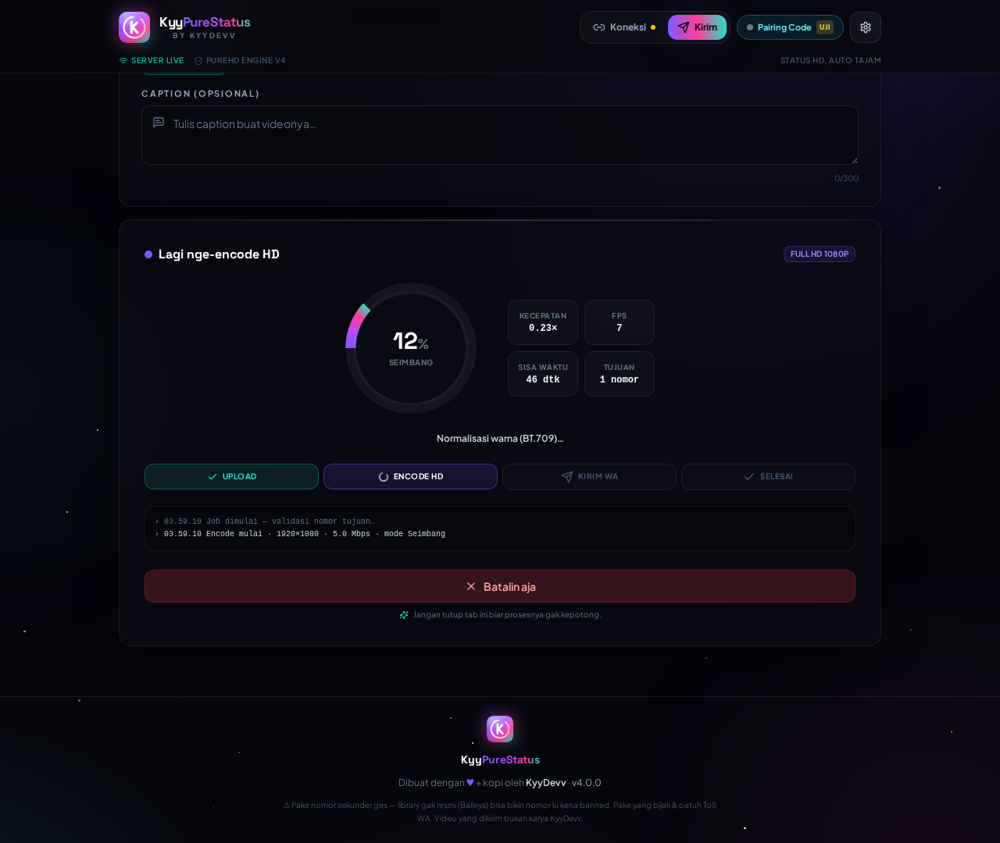
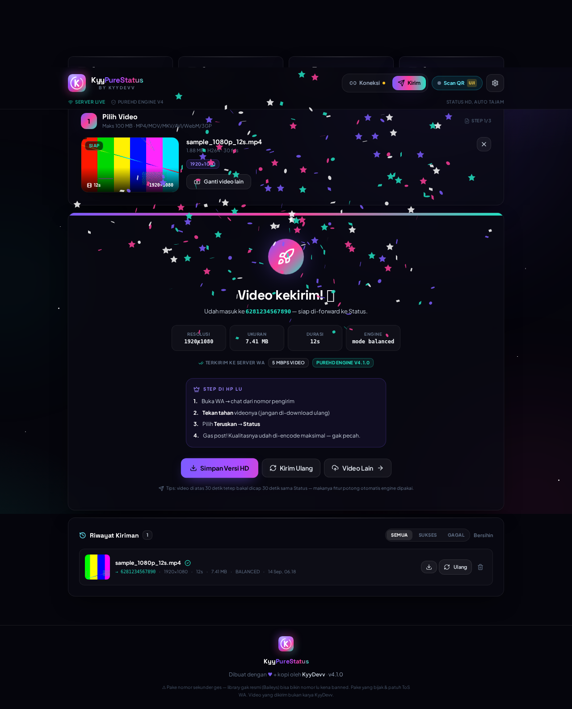
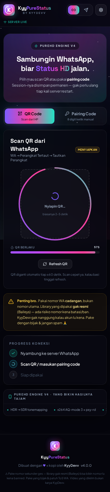
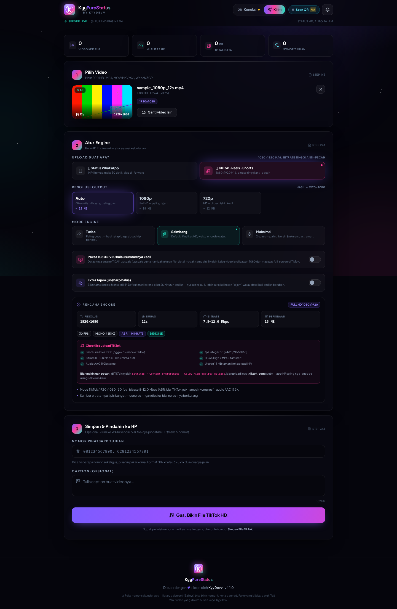
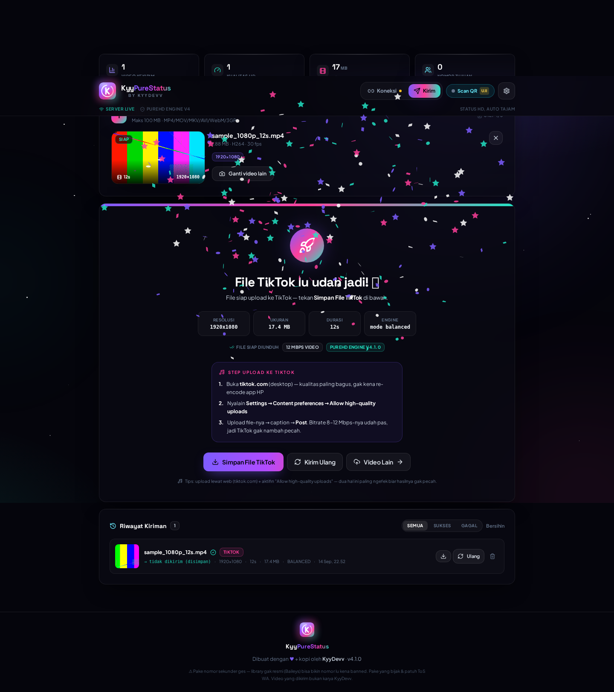
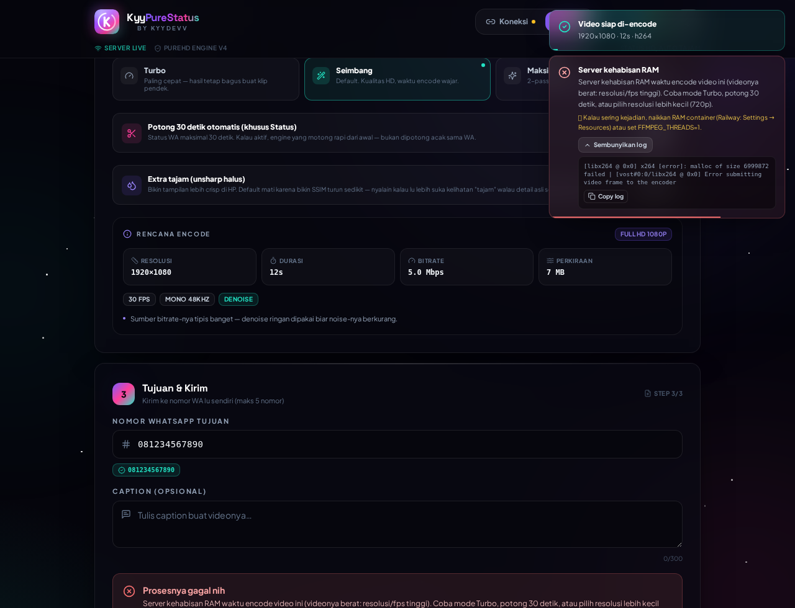

# ⚡ KyyPureStatus — Status HD, Auto Tajam

**v4.2.0 · by KyyDevv**

Web app buat ngirim video **HD anti pecah** ke nomor WhatsApp sendiri, terus tinggal
**tahan → Teruskan → Status**. Kualitasnya jauh lebih tajam dibanding upload langsung dari galeri.

> **Kenapa lebih tajam?** Waktu kamu upload dari galeri, WhatsApp meng-encode ulang videonya dan
> kualitas langsung turun (makanya pecah-pecah/blur). Di sini video dikirim sebagai **pesan video
> native yang sudah di-encode optimal** oleh **PureHD Engine v4** — pas di-forward ke Status,
> detailnya masih bertahan.

---

## 🆕 Yang Baru di v4

| Upgrade | Detail |
|---|---|
| 🎨 **Rebranding total** | Logo baru (status ring + monogram K), palet baru (violet → magenta → mint), splash, navbar, ikon PWA/APK, tipografi Plus Jakarta Sans + Space Grotesk |
| 🎵 **Mode TikTok (v4.2)** | Export khusus TikTok/Reels/Shorts: 1080×1920, ABR **8–16 Mbps**, 30/60 fps, AAC 192k, batas 280 MB — plus CLI `npm run tiktok` dan tombol *Simpan File TikTok* |
| 🎬 **PureHD Engine v4** | Mesin encode ditulis ulang dari nol — LANCZOS scaling, HDR→SDR tonemap, AQ-mode 3, 2-pass ABR, loudness EBU R128, GOP 2 detik |
| 🔑 **Pairing code DIPERBAIKI** | Asli nyala sekarang (detail bug di bawah), plus countdown, auto-refresh, deteksi kedaluwarsa |
| 🎚️ **3 mode encode** | Turbo (1-pass cepat) · Seimbang (default) · Maksimal (2-pass paling rapi) |
| 👁️ **Preview rencana encode** | Sebelum kirim, kelihatan resolusi, bitrate, estimasi ukuran, filter yang dipakai |
| ✂️ **Auto-trim 30 detik** | Khusus Status — engine yang motong rapi, bukan dipotong acak oleh WA |
| 📥 **Simpan / Kirim Ulang** | Video hasil kompres bisa diunduh kembali atau dikirim ulang sekali klik |
| 📊 **Progress & log live** | Progress mesin ffmpeg (`-progress pipe:2`) jadi % + ETA + speed akurat, plus log realtime |
| 📱 **PWA / install-able** | Manifest + ikon 1024px + splash — bisa di-install ke home screen (APK via PWABuilder/Bubblewrap) |
| 🩺 **`/api/health`** | Healthcheck buat Railway (kalau gagal, Railway auto-restart) |
| 🇮🇩 **Bahasa & UX** | Copywriting Indonesia, error message yang jelas, validasi nomor pintar |

---


## 🎵 Mode TikTok (v4.2) — anti pecah-pecah

Selain kirim ke **Status WhatsApp**, sekarang ada mode **TikTok / Reels / Shorts**.
Pilih platform di panel **"Upload Buat Apa?"** (Step 2), atau pakai CLI-nya.

Kenapa hasilnya gak pecah di TikTok? Karena TikTok **selalu** nge-encode ulang video yang
di-upload — jadi yang bikin pecah itu bukan "kualitas upload"-nya, tapi **bitrate sumber
yang terlalu tipis**. TikTok sendiri minta 8–16 Mbps; kalau kita kirim 3 Mbps (hasil CRF
default), begitu TikTok re-encode → langsung kelihatan blok-blok.

| Aspek | Mode WhatsApp (Status) | Mode TikTok |
|---|---|---|
| Resolusi | 1080×1920 (9:16) / 1080p | 1080×1920 (9:16), 1080×2340 kalau sumbernya 19.5:9 |
| fps | maks 30 | 30 / 50 / 60 (integer 24–60, auto pas sumbernya) |
| Bitrate | CRF hemat (≈ 5 Mbps) | **ABR 8–12 Mbps** (30fps) · **10–16 Mbps** (60fps) + `minrate` 70% |
| Audio | AAC 128k | AAC **192k** 48 kHz |
| Durasi | dipotong rapi 30 detik | utuh (TikTok boleh sampai 10 menit) |
| Batas ukuran | 50 MB (limit Status) | 280 MB (aman limit upload HP) |
| Upscale | tidak pernah | tidak (opsional **Paksa 1080** kalau sumbernya kecil) |
| Tampilan hasil | kartu "kekirim ke WA" | tombol **Simpan File TikTok** + langkah upload |

### Cara pakai lewat web

1. Tab **Kirim** → upload video → Step 2 **"Upload Buat Apa?"** → pilih **🎵 TikTok · Reels · Shorts**.
2. Panel **Rencana Encode** langsung nunjukin speknya + **Checklist upload TikTok** (6 poin, ijo semua = aman).
3. Nomor WA **opsional** di mode ini:
   - **kosong** → file-nya diunduh langsung dari kartu hasil (tombol *Simpan File TikTok*).
   - **diisi** → file dikirim ke WA lu sendiri biar gampang dipindah ke HP, lalu diunduh dari chat.
4. Upload lewat **tiktok.com** (web/desktop) dan nyalain
   **Settings → Content preferences → Allow high-quality uploads** — dua hal ini paling ngefek.

### Cara pakai lewat CLI (buat batch / tanpa buka web)

```bash
npm run tiktok -- video.mp4                       # 1080x1920 sesuai spek TikTok
npm run tiktok -- video.mp4 --mode max            # 2-pass ABR (bitrate mentok, paling aman)
npm run tiktok -- video.mp4 --force60             # paksa 60 fps
npm run tiktok -- video.mp4 --quality 720p        # 720x1280 kalau file mau kecil
npm run tiktok -- video.mp4 --upscale             # paksa 1080 walau sumbernya kecil
npm run tiktok -- folder/*.mp4 --out hasil/       # banyak file sekaligus
npm run tiktok -- video.mp4 --json                # output JSON (buat scripting)
```

CLI-nya otomatis **verifikasi hasil**: codec H.264, `yuv420p`, fps integer, ukuran ≤ 280 MB,
bitrate ≥ 6 Mbps — plus ringkasan tips. Contoh nyata: sumber HEVC 1440×2560 @120fps →
keluar 1080×1920 @60fps · 12.2 Mbps · 43 MB · semua cek lolos.

---

## 📸 Tampilan

| Koneksi + QR | Pairing Code | Atur Engine |
|---|---|---|
|  |  |  |

| Proses encode | Sukses | Mobile |
|---|---|---|
|  |  |  |

| Atur Engine (mode TikTok) | Hasil TikTok | Error informatif |
|---|---|---|
|  |  |  |

## 🔑 Pairing Code:v3 rusak → v4 beres

**Gejala di v3:** klik "Ambil Kode", kode gak keluar / muncul error, atau kode muncul terus hilang sendiri.

**Akar masalah & perbaikannya:**

| # | Bug v3 | Fix v4 |
|---|---|---|
| 1 | `requestPairingCode()` ditembak **sebelum** WebSocket ke WA kebuka → Baileys nolak (`Connection Closed`) | Tunggu `waitForSocketOpen()` + handshake `pair-device` (tunggu QR pertama dari server) baru minta kode |
| 2 | Socket tetap publish QR tiap ±20s dan `setState('qr')` **menghapus `pairingCode`** → kode hilang dari UI | Flag `pairingMode`: QR di-suppress selama pairing, kode gak bisa kehapus oleh event QR |
| 3 | Listener `sock.ev.on('pairing.code')` itu **event yang gak ada** di Baileys (dead code) | Diganti state + event `pairing:code` yang dikirim beneran ke UI |
| 4 | Setelah kode dipakai di HP, WA kirim stream error **515 (restart required)** → user stuck di "pairing" | 515 ditangani: socket di-restart cepat (1.2s) tanpa hapus session, login lanjut otomatis |
| 5 | Session setengah jadi (`creds.registered === false`) bikin WA nolak permintaan kode | Deteksi + bersihkan session mati sebelum pairing |
| 6 | Nomor `0812…` / `+62…` / ada spasi bikin gagal | Normalisasi otomatis: `0812…` → `62812…`, `812…` → `62812…`, validasi jelas |
| 7 | Kode expired diam-diam (WA cuma kasih ±2 menit) | Countdown visual, badge "Kedaluwarsa", tombol "Bikin kode baru" (`/api/connect/pairing/refresh`) |
| 8 | Gak ada jalan keluar kalau pairing gagal | Tombol "Ribet? Balik ke mode QR" (`/api/connect/pairing/cancel`) |

Endpoint baru:

```
POST /api/connect/pairing          { number }   → minta kode (+ info TTL)
POST /api/connect/pairing/refresh  { number }   → kode baru kalau basi
POST /api/connect/pairing/cancel                → batal pairing, balik ke QR
```

> Kode pairing **wajib 8 karakter**, huruf kecil saat dimasukin di HP (contoh: `zmp3be5q`).

---

## 🎬 PureHD Engine v4 — bikin hasil gak pecah

10 perbaikan teknis dibanding engine v3:

1. **Scaling LANCZOS** (`flags=lanczos+accurate_rnd+full_chroma_int`) — v3 pakai scaling default (bilinear) yang buram.
2. **HDR → SDR tonemapping** (`zscale` + `tonemap=hable`) — video HDR 10-bit dari iPhone/Android gak lagi pucet/kebiru.
3. **Framerate dinormalisasi lewat filter `fps`** (CFR, maks 30) — v3 pakai `-r 30` yang bikin frame dobel/drop → gerakan patah-patah.
4. **x264 tuning agresif**: `aq-mode=3` (anti-banding di scene gelap), `psy-rd=1.0,0.15`, `subme=8`, `trellis=2`, `rc-lookahead=60`, `deblock=-1,-1`, `ref=5`, `bframes=3`, `me=umh`.
5. **Bitrate ladder naik**: 1080p cap 8 Mbps (v3: 6), 720p cap 5 Mbps (v3: 4).
6. **Preset default `medium`** (v3: `faster`) + opsi `slow` buat mode Maksimal.
7. **Mode encode adaptif** — Turbo (1-pass CRF) / Seimbang (CRF + VBV cap, default) / Maksimal (2-pass ABR, ukuran pasti aman).
8. **Light unsharp luma** (`unsharp=5:5:0.32:5:5:0`) — detail tetap kerasa setelah WA re-encode. Cuma di luma, jadi warna gak "goreng".
9. **Loudness audio EBU R128** (`loudnorm=I=-16:TP=-1.5`) — suara rata, aman dari clipping saat WA encode ulang.
10. **GOP 2 detik + faststart + tag BT.709** — seek cepat di WA, warna konsisten, kompatibel semua player.

Bonus: **auto-trim 30 detik** (limit Status) dihitung dari plan, jadi resolusi bisa tetap 1080p dan
potongannya rapi — bukan dipotong sembarangan sama WhatsApp.

### Tabel profil adaptif (auto)

| Durasi video | Profil | Box maks | Cap bitrate | CRF |
|---|---|---|---|---|
| ≤ 60 detik | **Full HD 1080p** | 1920×1080 / 1080×1920 | 8 Mbps | 19 |
| 61 – 120 detik | **HD 720p** | 1280×720 / 720×1280 | 5 Mbps | 19 |
| 121 – 240 detik | SD 480p | 854×480 | 2.8 Mbps | 20 |
| > 240 detik | Hemat 360p | 640×360 | 1.8 Mbps | 21 |

- Tidak pernah upscale (video kecil dibiarkan apa adanya) · AR selalu dijaga · dimensi selalu genap.
- Output: `.mp4` H.264 **High** + AAC 128k 48 kHz + `+faststart`.

### Hasil pengukuran (data, bukan klaim)

```bash
npm run bench          # bandingkan v3 (lama) vs v4 di semua file /samples
npm run bench:hq       # + sumber HQ sintetis 1080p detail tinggi
```

Metriknya **bukan SSIM mentah** (itu menyesatkan untuk kasus ini). Benchmark mensimulasikan
**re-encode WhatsApp Status** (2 profil: HD & hemat) lalu mengukur SSIM/PSNR **hasil simulasi vs
video sumber asli** → angka yang bertahan = seberapa tajam video di Status nanti.

Contoh keluaran di CI sandbox (ffmpeg 7.0.2, 3 thread):

| Sumber | v3 (lama) | v4 balanced | Catatan |
|---|---|---|---|
| 1080p 12s (1.2 Mbps) | SSIM 0.9961 · PSNR 45.5 | **SSIM 0.9956 · PSNR 45.2** | praktis setara (−0.05 poin) |
| portrait 720×1280 10s | SSIM 0.9946 · PSNR 43.17 | **SSIM 0.9946 · PSNR 43.24** | setara, PSNR lebih tinggi |

Artinya: **v4 gak mengorbankan detail asli** (fidelity setara, bahkan PSNR lebih baik di sumber portrait),
tapi dapat bonus yang gak kelihatan di metrik itu:

- **Gerakan lebih mulus** — v3 pakai `-r 30` (frame dobel/drop), v4 pakai filter `fps` (CFR beneran).
- **Warna aman** — video HDR/10-bit gak lagi pucet (tonemap BT.709).
- **Audio rata** — loudness EBU R128, gak ada video yang kekecilan/gede suaranya.
- **Mode Maksimal (2-pass)** — ukuran file pasti aman, kualitas box paling rapi.
- **Opsi "Extra Tajam"** — kalau lu lebih suka tampilan crisp, tinggal nyalain (sadar ada trade-off).

> Catatan tuning: awalnya engine ini pakai unsharp agresif + denoise secara default, tapi hasil
> benchmark nunjukin itu **menurunkan SSIM** (0.9943 → 0.9930) tanpa benefit nyata, jadi keduanya
> diubah jadi **opt-in**. Data > asumsi. Semua angka di atas bisa lu reproduksi sendiri pakai `npm run bench`.

---

## ✨ Fitur Lengkap

| Fitur | Keterangan |
|---|---|
| 📱 **Koneksi WhatsApp** | QR real-time auto-refresh **atau** Pairing Code 8 digit (sekarang beneran jalan) |
| 💾 **Session persistent** | Multi-file auth state di volume — gak perlu scan ulang tiap restart/redeploy |
| 🔄 **Auto-reconnect** | Backoff + jitter, plus restart cepat khusus kode 515 setelah pairing |
| 🎚️ **Kontrol engine** | Pilih resolusi, mode encode, auto-trim; preview rencana + estimasi ukuran |
| 📤 **Kirim native video** | Pesan video (bukan dokumen) + metadata width/height/duration → siap di-forward ke Status |
| 📊 **Progress real-time** | Upload → Encode (%, ETA, speed, FPS, pass) → Kirim → Sukses, via Socket.io |
| ✅ **Tracking centang** | Event `messages.update` diteruskan ke UI (`send:ack`) |
| 🕘 **Riwayat + resend** | 12 video terakhir disimpan; bisa **Kirim Ulang** & **Simpan Versi HD** |
| 🖼️ **Thumbnail** | Auto-generate untuk riwayat (crop 360×360) |
| ⚙️ **Pengaturan** | Nomor default, caption default, kualitas/mode/trim default, info engine, reset |
| 🛡️ **App Key opsional** | Proteksi akses publik (`APP_KEY`) — termasuk handshake Socket.io |
| 🧹 **Auto-cleanup** | Upload basi & video lama di-prune tiap 10 menit |
| 🚀 **Railway-ready** | Dockerfile + Procfile + `/api/health` + volume `/data` + env example |

---

## 🚀 Deploy ke Railway

1. **Push repo ini ke GitHub** (lihat bagian "Push ke GitHub" di bawah).
2. Railway → **New Project → Deploy from GitHub repo** → pilih repo ini.
3. Railway otomatis mendeteksi `Dockerfile`. Repo ini juga sudah menyertakan **`railway.json`**
   (builder = Dockerfile, healthcheck `/api/health`, auto-restart on failure) jadi tinggal deploy.
4. **Tambah Volume** (wajib, biar session WA gak hilang tiap redeploy):
   Railway → service → **Variables/Data → Add Volume** → mount path `/data`.
   Set env `DATA_DIR=/data` (kalau volume di-mount, `RAILWAY_VOLUME_MOUNT_PATH` juga otomatis kebaca).
5. **Variables** yang disarankan:

   | Variable | Nilai | Kenapa |
   |---|---|---|
   | `PORT` | `3000` (atau biarkan Railway) | port server |
   | `DATA_DIR` | `/data` | session + riwayat persisten |
   | `APP_KEY` | `rahasia-lu` | biar gak dipakai orang lain (opsional tapi disarankan) |
   | `ENGINE_MODE` | `balanced` | mode encode default |
   | `MAX_UPLOAD_MB` | `100` | batas upload |
   | `MAX_OUTPUT_MB` | `50` | batas ukuran output (aman buat WA) |
   | `AUTO_TRIM_STATUS` | `false` | `true` = otomatis potong 30 detik |
   | `KEEP_VIDEOS` | `12` | berapa video tersimpan buat resend |

6. Deploy → buka domain Railway → **Koneksi → Pairing Code** → masukin nomor WA lu → masukkan kode di HP.
7. Buka tab **Kirim** → upload video → **Gas, Encode HD & Kirim!** → teruskan ke Status dari HP.

> **Penting soal resource:** encode video itu berat. Railway plan kecil (0.5–1 vCPU) masih jalan,
> tapi pakai **mode Turbo** untuk video panjang. Bisa juga set `FFMPEG_THREADS=2` kalau container-nya kecil.

---

## 💻 Jalankan Lokal

```bash
npm install                 # install root + client (workspaces)
npm run dev                 # server :3001 + vite :5173 (proxy /api & /socket.io)
# atau produksi:
npm run build && npm start  # server :3000 menyajikan hasil build + API
```

Uji tanpa nomor asli:

```bash
MOCK_SEND=true npm start    # koneksi WA disimulasikan, alur upload→encode→kirim tetap jalan
npm run smoke               # test otomatis end-to-end (butuh MOCK_SEND)
```

## 📱 Jadikan APK

Web app ini **PWA-ready** (manifest + ikon 1024 + splash). Cara paling gampang:

1. Deploy ke Railway, buka pakai Chrome Android.
2. Menu browser → **Add to Home screen** (jalan sebagai app standalone).
3. Mau file APK beneran? Tempel URL Railway ke **PWABuilder.com** atau pakai **Bubblewrap CLI** —
   ikon & manifest-nya sudah disiapkan.

---

## 🧱 Struktur & Tech Stack

```
server/
  index.js       Express + Socket.io, REST API, pipeline job
  whatsapp.js    Baileys manager (QR + pairing code + reconnect + ack tracking)
  video.js       PureHD Engine v4 (planning, filter, encode, thumbnail, ssim)
  history.js     Riwayat JSON di volume
  config.js      Konfigurasi env-based
client/
  src/components  Splash, Navbar, ConnectPage, SendPage, EngineControls,
                  ProcessPanel, SuccessCard, HistoryPanel, SettingsModal, ...
  src/lib         api.js (XHR upload + fetch), store.js (preferensi)
  public/brand    Aset logo (SVG) — sumber ikon
  public/icons    Ikon PWA/APK (PNG 1024 → 32)
scripts/
  smoke.js        Test end-to-end dengan nomor palsu
  engine-bench.js Benchmark kualitas (simulasi re-encode WA)
tools/
  make-icons.js   Regenerate ikon dari logo SVG
```

- **Frontend:** React 18 · Vite 5 · Tailwind CSS 3 · Framer Motion · Socket.io-client · qrcode.react · canvas-confetti
- **Backend:** Node.js 18+ · Express 4 · Socket.io · Multer
- **WhatsApp:** `@whiskeysockets/baileys` (multi-device, multi-file auth state)
- **Video:** ffmpeg (sistem di Docker, `ffmpeg-static` kalau lokal) + `ffprobe`
- **Opsional dev:** `sharp` (cuma buat `npm run icons` — ganti logo)

---

## 🔌 API Ringkas

| Method | Endpoint | Fungsi |
|---|---|---|
| GET | `/api/health` | Healthcheck (Railway) — status server, WA, engine |
| GET | `/api/config` | Konfigurasi publik + profil & mode engine |
| GET | `/api/engine` | Detail engine + kapabilitas ffmpeg |
| GET | `/api/status` | Status koneksi WA + info pairing |
| POST | `/api/connect/qr` | Minta QR |
| POST | `/api/connect/pairing` | Minta pairing code |
| POST | `/api/connect/pairing/refresh` | Kode baru |
| POST | `/api/connect/pairing/cancel` | Batal pairing |
| POST | `/api/disconnect` · `/api/logout` | Putuskan / logout |
| POST | `/api/upload` | Upload video (multipart) + rencana encode |
| POST | `/api/plan` | Hitung ulang rencana encode |
| GET/DELETE | `/api/history[/:id]` | Riwayat |
| GET | `/api/thumb/:id` · `/api/download/:id` | Thumbnail · unduh hasil HD |

**Socket.io:** client → `video:process`, `video:resend`, `video:cancel`, `history:get`, `history:delete`
· server → `conn:update`, `pairing:code`, `job:start`, `compress:start`, `compress:progress`,
`compress:done`, `send:start`, `send:ack`, `send:done`, `send:error`, `history:update`, `notice`

---

## 🛠️ Troubleshooting

| Masalah | Solusi |
|---|---|
| Upload ke TikTok masih keliatan pecah | Pastikan pakai **mode TikTok** (bukan mode WA) — bedanya bitrate 8–12 Mbps vs 5 Mbps. Lalu upload via **tiktok.com** + nyalain **Allow high-quality uploads**. Video di bawah 1080 tetap 720 (TikTok gak nambah detail) — kalau maksa, nyalain **Paksa 1080×1920**. |
| Pairing code gak muncul | Tunggu 3–5 detik (handshake), lalu klik lagi. Kalau tetap gagal, refresh halaman → coba mode QR dulu sekali, baru pairing. |
| Kode kedaluwarsa terus | Masukin kode di HP **langsung** (WA cuma kasih ±2 menit), atau klik **Bikin kode baru**. |
| Kode ditolak di HP | Pastikan masukin **8 karakter, huruf kecil semua**. Kode sekali pakai — kalau salah 3x, bikin baru. |
| WA logout sendiri | Nomor kena batasi WA (atau dipakai di tempat lain). Tunggu beberapa jam, pakai nomor lain, jangan spam. |
| Video kegedean buat WA | Turunkan resolusi (720p) atau pakai **mode Maksimal** + aktifkan **potong 30 detik**. |
| Hasil masih kerasa kurang tajam | Pakai **mode Maksimal** (2-pass), resolusi **1080p**, dan **jangan** kirim ulang dari galeri HP. |
| Encode lama / server nge-lag | Pakai **mode Turbo**, set `FFMPEG_THREADS=2`, atau upgrade plan Railway. |
| **Video HD "Gagal proses video" (video kecil lancar)** | Ini bug yang **sudah diperbaiki di v4.1**: (1) level H.264 di-hardcode `4.2` padahal frame 1080×1920 (portrait) butuh DPB lebih besar → x264 nolak jalan (`DPB size ... > level limit`); (2) RAM container habis karena filter berat jalan di resolusi sumber + `rc-lookahead=60`. Sekarang level & ref dihitung otomatis dari ukuran frame, filter dijalankan setelah downscale, dan ada **retry otomatis** ke setting hemat (progress bar nunjukin "Coba ulang otomatis"). |
| Video 2K/4K/120fps terasa lama | Wajar — decode HEVC 2K + downscale berat. Pakai **mode Turbo** atau aktifkan **potong 30 detik**. Server RAM kecil otomatis pakai mode hemat (target 720p). |
| Mau tahu server ini RAM-nya berapa? | Buka `/api/health` → ada `mem.limitMB` dan `mem.lowMem`. Kalau `lowMem: true`, engine jalan di mode hemat. |
| Session hilang tiap deploy | Volume belum di-mount. Tambah volume di `/data` dan set `DATA_DIR=/data`. |
| **Deploy gagal: `sh: 1: vite: not found`** | Penyebab: `npm install` jalan saat `NODE_ENV=production` aktif → npm buang **devDependencies**, padahal `vite` itu devDependency (buat build frontend). **Sudah diperbaiki** di `Dockerfile` v4: `NODE_ENV` di-set **setelah** build, install pakai `NODE_ENV=development npm ci --include=dev`. Kalau lu masih pakai Dockerfile lama, replace dengan yang baru lalu **Redeploy**. Cek: build log harus lewat langkah `[9/9] RUN npm run build` dengan `✓ built in ...`. |
| Build jalan tapi app blank/404 | Pastikan langkah build sukses (`client/dist/index.html` ada). Dockerfile v4 sudah ada `test -f client/dist/index.html` biar gagal lebih awal, bukan diam-diam. |
| Deploy sukses tapi healthcheck gagal | Cek `PORT` (default 3000) dan pastikan Railway healthcheck path = `/api/health` (sudah otomatis dari `railway.json`). |

---

## ⚠️ Disclaimer

Library yang dipakai (**Baileys**) **bukan resmi** — WhatsApp bisa membatasi/men-ban nomor yang
memakainya. **Pakai nomor cadangan**, jangan spam, dan patuhi ToS WhatsApp. KyyDevv gak tanggung
jawab atas akun yang kena banned atau konten yang dikirim. Video yang diproses bukan karya KyyDevv.

---

## 📄 Lisensi

MIT — bebas dipakai & dimodifikasi. Credit **KyyDevv** tetap dicantumkan ya 🙏
